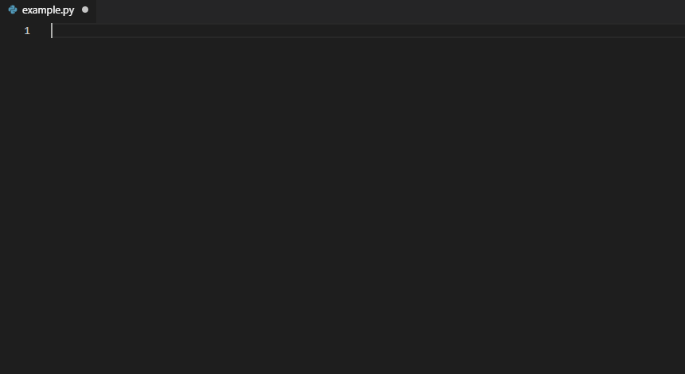

# PyTorch Code Snippets for VSCode

[](https://marketplace.visualstudio.com/items?itemName=SBSnippets.pytorch-snippets)
[](https://marketplace.visualstudio.com/items?itemName=SBSnippets.pytorch-snippets)
[](https://marketplace.visualstudio.com/items?itemName=SBSnippets.pytorch-snippets)
[](LICENSE.md)
[](https://github.com/SvenBecker/vscode-pytorch/releases)

This project aims to provide a faster workflow when using the [PyTorch](https://github.com/pytorch/pytorch) or [fastai](https://github.com/fastai/fastai) library in [Visual Studio Code](https://code.visualstudio.com/).
This extension provides code snippets for often used coding blocks as well as code example provided by the libraries for common deep learning tasks.

## Table of Contents

1. [Getting Started](#usage)
    1. [PyTorch Preview](#pytroch)
    2. [Fastai Preview](#fastai)
2. [Installation](#installation)
3. [Changelog](#changelog)
4. [Get Involved](#involved)
    1. [Contributing](#contributing)
    2. [Future Plans](#plans)
    3. [Contact](#contact)
5. [Credits](#credits)

## <a name="usage" > </a> Getting Started

If this extension is installed and activated you might notice by start typing `pytorch` or `fastai` in your python file a dropdown
list appears. Entries starting with `pytorch:` or `fastai:` represent code snippets refering to those libraries offered by this extension.
Snippets appear in the same way as code completion by using `Ctrl+Space`. I defined variables inside the code snippets so you can jump from one
variable to another by pressing `Tab`. Examples on how to use this extension are shown below.
For a full overview please take a look at the [Snippet Collection](COLLECTIONS.md).

### <a name="pytorch" > </a> PyTorch Preview



### <a name="fastai" > </a> Fastai Preview


### <a name="installation" > </a> Dependencies

Currently the snippets are working for the latest releases of the supported libraries:

* fastai >= 1.0.21
* pytorch >= 0.4.1

>__Info__:
>Be aware that at the time the fastai library is changing rapidly, so I can not guarantee that every snippet is actually working.
>I will try to keep the snippets in line with the latest fastai library developments (as well as the latest pytroch releases), so it might not work for you in case you are using an _outdated_ version.

<div class="alert alert-success">
Be aware that at the time the fastai library is changing rapidly, so I can not guarantee that every snippet is actually working.
I will try to keep the snippets in line with the latest fastai library developments (as well as the latest pytroch releases), so it might not work for you in case you are using an _outdated_ version.
</div>

## <a name="installation" > </a> Installation

The installation process is very straightforward. The most recommend way is shown below.

1. Launch Visual Studio Code
2. From the command palette `Ctrl-Shift-P` (Windows, Linux) or `Cmd-Shift-P` (MacOS) select Install Extension or just simply go to the VS Marketplace
3. Type `PyTorch Snippets`
4. Choose and install extension
5. Restart/reload Visual Studio Code

This will give you the most recent version you can find on the [VS Marketplace](https://marketplace.visualstudio.com/vscode).
Alternatively you can also clone this repository and move it manually into your VS Code extension folder which will give you
the most recent version on GitHub.

```sh
git clone https://github.com/SvenBecker/vscode-pytorch.git
mv vscode-pytorch /path/to/your/VSCodeExtensionFolder/
```

On Windows for example you can normally find the extension folder at `C:\Users\YourName\.vscode\extensions`. On MacOS and Linux it should be located at `~/.vscode/extensions`.

> __Info__: The second method will give you the overall most recent version because I won't update the VS Marketplace version as often
> as the GitHub version but the VS Marketplace version will probably be the more stable one.

## <a name="changelog" > </a> Changelog

Version 0.1.1 Changes:

- Added lots of Fastai Snippets (including NLP, Computer Vision, Tabular Data and Collaborative Filtering).
  
All of the past as well as the upcoming changes can further be viewed at [Changelog](CHANGELOG.md).

## <a name="involved" > </a> Get Involved

### <a name="contributing" > </a> Contributing

If you want to contribute, what I would highly appreciate since this project is currently in a very early stage
and there is still so much to do, please take a look at [Contributing](CONTRIBUTING.md).

### <a name="plans" > </a> Future Plans

I would like to extend snippet options to additional packages which are related to PyTorch.
This might include [Ignite](https://github.com/pytorch/ignite) or [Pyro](https://github.com/uber/pyro).

Furthermore, but not in this project, I would like to offer VS Code snippets for visualization in Python, like for
example [Matplotlib](https://matplotlib.org/api/pyplot_api.html) or [Seaborn](https://seaborn.pydata.org/). Eventually even considering the inclusion of interactive visualization libraries like [Bokeh](https://bokeh.pydata.org/en/latest/) or [Plotly](https://plot.ly/). If anyone is interested in this kind of project and/or want to offer some help please
[contact](#contact) me.

### <a name="contact" > </a> Contact

Suggestions for improvements will be highly appreciated. You can write me an email (address is provided on my [profile](https://github.com/SvenBecker)) or you can contact me via Twitter [@SBX9209](https://twitter.com/SBX9209).

## <a name="credits" > </a> Credits

* [PyTorch](https://pytorch.org/): A huge thanks to the PyTorch team for building such an awesome, easy to use deep learning framework and for offering a numerous amount of code examples.
* [Fastai](https://www.fast.ai/): Also a huge thanks to Jeremy Howard and the whole fast.ai team for creating this great deep learning library and also for offering wonderful, very practical orientated free lectures giving insight to deep learning to a wide range of people including ml/dl beginners as well as advanced practitioners.
* [VSCode](https://code.visualstudio.com/): My personal favorite text editor and I'm grateful for all the options they are offering, like a huge amount of language support, extensions, integrated terminal, debugger etc..
